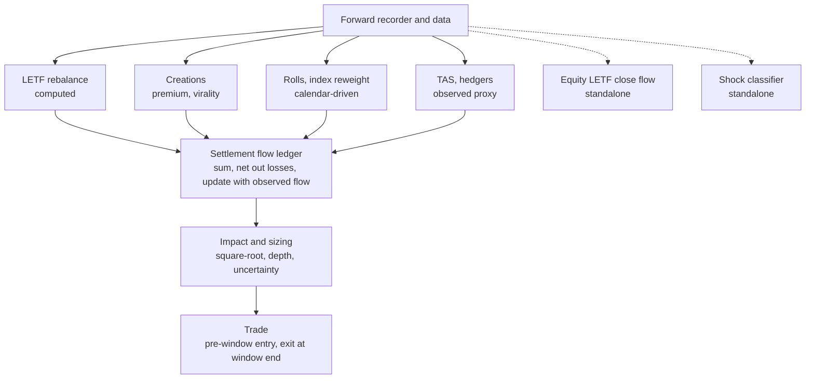

# Forced-Flow Research Stack — Architecture Overview

**Version:** v1.0 (2026-09-21)  
**Current version:** v1.1 (2026-09-21), additive: records current doc versions and how power analysis interacts with the testing tracks. All v1.0 text is retained.  
**Current version:** v1.2 (2026-09-21), additive: adds the opening agent-state model. All v1.1 text is retained.
**Owner:** Oisin
**Suggested repo path:** `docs/research/ARCHITECTURE_OVERVIEW.md`
**Status:** descriptive. This doc explains how the models fit together. It adds **no** hypotheses, thresholds or rules. Where it and a pre-registration disagree, **the pre-registration wins**.

---

## 1. One-paragraph summary

We superpose the forced flows of mechanical market participants, subtract what has already been absorbed, update with flow we can observe, and convert what remains into an expected price move. The core use is trading the hour around each daily settlement window in CME energy futures. One engine (the **settlement flow ledger**) combines several **flow sources**. A calendar model (the **index reweight**) feeds it in January. Two **standalone strategies** (equity LETF close flow, shock classifier) run alongside and merge only if each works on its own.

---

## 2. Document map

| Doc | Role | Current version |
|---|---|---|
| `SETTLEMENT_FLOW_LEDGER_PREREG.md` | Combining engine for NG/CL settlement-window flow; participants P1–P9; testing tracks | v1.6 |
| `INDEX_REWEIGHT_FLOW_PREREG.md` | BCOM/GSCI annual reweight and monthly-roll flow, ~15 CME commodities | v1.1 |
| `LETF_CLOSE_FLOW_PREREG.md` | Standalone: equity leveraged-ETF rebalance into the 16:00 ET close (NQ/ES) | v1.0 |
| `SHOCK_CLASSIFIER_PREREG.md` | Standalone: information vs liquidity shocks, 5–60 min (NQ, ES, CL, GC) | v1.0 |
| `ARCHITECTURE_OVERVIEW.md` | This doc: how the above interact | v1.0 |

**Current versions (v1.1 update):** ledger v1.8, index reweight v1.3, LETF close flow v1.2, shock classifier v1.2, this overview v1.1.

**Added in v1.2:** `OPENING_AGENT_STATE_PREREG.md` (v1.0): cross-sectional agent model at the ES/NQ cash open with a day-type state and progression layer. It reuses the ledger's agent structure, retention rule, timing template, error budget, power rules and three tracks.

---

## 3. Layered architecture

### 3.1 Data layer
A single forward recorder (ledger doc, 13A.3) captures everything with no reliable history, from today onward. Shared data gives consistent timestamps and one set of point-in-time rules.

| Category | Examples |
|---|---|
| Fund data | Holdings (contract months, futures vs swaps), NAV, shares/units outstanding, effective leverage, roll schedules |
| Exchange data | Settlements, 1-min bars, aggressor-side trades, TAS, market-by-order depth, options open interest |
| ETF market data | NBBO midpoints and trades for the US commodity ETFs |
| Attention | GDELT news, Wikipedia hourly pageviews, social archives (if lawful) |
| Positioning | CFTC disaggregated COT (swap dealers), commodity index trader supplement |
| Swaps | Public swap dissemination records |
| Index facts | BCOM/GSCI target weights, AUM estimates, methodology dates |

**Rule:** for forward tests, a record's `fetched_at` time is when it became usable.

### 3.2 Flow sources
Each source models one class of forced participant. They differ in how knowable they are:

| Knowability | Sources |
|---|---|
| **Computed** (formula plus public data) | P1 leveraged-ETF rebalance; P8a fund rolls; index reweight flow (drift-based) |
| **Modelled** (forecast from observable drivers) | P3/P4 creations via premium and virality; P9 non-US ETPs (leverage and swap routing) |
| **Observed proxy** | P5 TAS liquidity providers; P6 commercial hedgers (TAS residual) |
| **Latent** (estimated from footprints) | P2 bank netting; pre-absorption fraction; market-maker hedged fraction h |
| **Impact only** | P7 HFTs (set price per unit of flow, add no net flow) |

### 3.3 Combining engine: the settlement flow ledger
1. **Prior:** sum of active source forecasts, with uncertainty per term.
2. **Losses:** netting, market-maker hedging and pre-positioning remove flow before the window.
3. **Update:** Kalman-style update using flow observed between 13:30 ET and t0 (optionally large-lot only).
4. **Output:** expected remaining flow `Q_rem` and its uncertainty.

### 3.4 Impact and sizing
- Square-root impact on `Q_rem`, fixed coefficient; optionally scaled by live order-book depth.
- Trade only if the expected move is ≥ 3× round-trip cost **and** the signal-to-noise clears its threshold.
- Size scales with edge divided by variance, capped by prop limits.

### 3.5 Execution
Signal at t0, fill at t0+1 (stress: worst of t0+1 … t0+5), exit at the end of the settlement window, with stop, early-profit and flow-reversal exits. The same fill and cost model is used everywhere.

---

## 4. How the models overlay in time

| Cadence | What's active | Where the flow lands |
|---|---|---|
| **Every trading day** | P1 rebalance, P3/P4 creations, P5/P6 TAS, P2/P9 swap-routed flow | NG/CL settlement windows |
| **Monthly roll days** | P8a fund rolls; BCOM/GSCI monthly rolls | Calendar spreads; also the index model's impact calibration sample |
| **January execution days (6th–10th business day, verify)** | Index reweight flow | NG/CL (fed into the ledger) and the other CME index commodities (index doc's own trades) |
| **Restrike moments** | WisdomTree 3× intraday resets | A specific intraday minute, not the settlement window |
| **Late October** | BCOM target-weight announcement | Starts the index model's forecast and the freeze deadline |
| **16:00 ET daily** | Equity LETF close flow (standalone) | NQ/ES into the cash close |
| **Any time** | Shock classifier (standalone) | 5–60 min after a detected shock |

---

## 5. Cross-links between models

| From | To | Link | Status |
|---|---|---|---|
| Index reweight | Ledger | Supplies NG/CL flow on January execution days | Pre-registered (index doc R-D9) |
| Index monthly-roll model | Ledger P8b | Could replace the scaled tracker-roll flag | Future |
| P8a fund rolls | Calendar-spread variant | Roll flow mainly moves near-vs-next spreads | Diagnostic (H13); future variant |
| Restrike events (P9) | Shock classifier | Candidate t0 triggers | Future |
| Premium stress (P3.6) | Shock classifier | Market-maker stress suggests liquidity shocks, so reversion | Future |
| Equity LETF close flow | Ledger P1 | Same rebalance formula, different market and time | Shared code only |
| Shock classifier | Ledger | A shock inside 13:30–14:10 ET could adjust ledger trades | Future |

---

## 6. Double-counting guards

| Risk | Guard |
|---|---|
| A fund counted in both P8a (computed rolls) and P8b (tracker flag) | P8b excludes every P8a fund (ledger unit test 40) |
| Index flows counted by both the index model and the ledger's P8b in January | Ledger P8b excludes BCOM/GSCI while the index model is active (R-D9) |
| TAS flow counted as both liquidity-provider and fund flow | P5/P6 collapse if funds don't use TAS (ledger D4) |
| Creations counted at settlement when market makers hedged them intraday | Only the unhedged fraction (1 − h) enters the window (P3.5) |
| Swap-routed exposure counted as futures flow | Split by f_fut; the swap part goes through netting (P2, P9) |

---

## 7. Shared components (build once, reuse)

| Component | Used by |
|---|---|
| Forward recorder | All models |
| Settlement window table (sourced, with effective dates) | Ledger, index model |
| Square-root impact model (fixed Y = 0.7) and depth variant | Ledger, index model (LETF close and shock classifier use their own cost checks) |
| Fill model (t0+1, stress fill, intra-bar pessimism) | All models |
| CostStack | All models |
| Error budget | Ledger, index model |
| Trial log and Deflated Sharpe Ratio | All models |
| Existing framework layers (data / signals / strategies / portfolio / execution / backtest / analytics, walk-forward, Monte Carlo, Tearsheet) | All models |

---

## 8. Guardrails on growth

1. **Stages must earn their place.** Every new source enters as a stage and stays only if it improves out-of-sample flow prediction by the pre-registered margin (ledger Section 6).
2. **Error budget directs effort.** Remaining stages may be reordered towards the largest error. No unregistered stage can be added that way.
3. **Standalone first.** The equity LETF close-flow model and the shock classifier merge with the ledger only after each passes its own pre-registration.
4. **Additive amendments only.** Changes to a pre-registration are versioned and additive, and made before the code changes.
5. **Kill quickly.** Stage A of the ledger and Gates R0/C0 of the index model are designed to reject a dead premise in weeks.

---

## 9. Testing across the stack

| Track | Scope | Notes |
|---|---|---|
| 1. Backtest | Every stage with point-in-time history | Stage A or A-lite first; index model uses leave-one-year-out |
| 2. Forward recorder | Everything without history | Started first; gaps logged, never filled |
| 3. Live-small / paper | Fills, latency, costs; then forward-only stages | Frozen protocol; 300-trade target with futility looks |

**Power across the stack (v1.1):** every stage and strategy records its power class (individually testable, underpowered → alternative method, immaterial, or contractual) together with its track, before running.

| Model / participant group | Power class (planned) | How it's validated |
|---|---|---|
| Ledger P1, TAS, creations, fund rolls, continuous attention | Individually testable | Marginal-contribution tests with SE and MDE |
| Ledger P2 netting, pre-absorption, hedged fraction | Latent | Parameter recovery, then decision relevance |
| Ledger P9 non-US ETPs | Not individually testable | Scale check, pooling, total-improvement rule |
| Restrikes | Contractual timing; magnitude marginal | Applied, not traded; calibration check |
| Index monthly-roll calibration | Individually testable | Walk-forward fit on flow |
| Index annual price effects | Marginal (10 years) | Pooled test + yearly sign test + calibration |
| Equity LETF close flow | Testable in backtest; forward likely underpowered | Track 1 primary; Track 3 consistency route likely |
| Shock classifier | Testable in backtest and forward | Forward N = 300 efficacy test feasible within about a year |

Forward-only stages get power-based evaluation lengths (capped at 500 days), and any forward sample too small to prove an effect is used as a **consistency check** against the backtest instead.

**Opening agent-state model (v1.2):** a second combining engine, parallel to the settlement ledger but at the 09:30 ET cash open. Agents (stop holders, trend followers, volatility-targeting funds, macro reactors, index arbitrage, options dealers, institutional algorithms) produce standardised pre-open pressures. A small classifier combines them with opening behaviour to estimate the day-type state (continuation, reversal, fade, range) and its progression, and a gain-scheduled policy trades or stands aside.

| Model | Market and time | Relationship |
|---|---|---|
| Settlement flow ledger | NG/CL, settlement windows (~14:30 ET) | Parent design |
| Opening agent-state model | ES/NQ, 09:30–11:30 ET | Same agent pattern plus state layer |
| Shock classifier | NQ/ES/CL/GC, any time | Shares liquidity-shock features with the opening model |
| Equity LETF close flow | NQ/ES, 16:00 ET | Candidate agent for the next day's open |

**Programme-level false-positive controls (added with ledger v1.9 and opening v1.1):** one sealed vault (2025-03-01 → 2026-09-18, one look per model), a programme registry splitting α = 0.05 into 10 slots of 0.005, a programme-level Deflated Sharpe, a 50% haircut on surviving edges, episode and shared-period checks, one-bar-delay robustness and a leak canary. Currently written into the ledger (13A.8) and opening model (12A); the other docs should adopt them by additive amendment before their testing starts.

**Next forward event:** the January 2027 index reweight. The index model must be frozen before the late-October 2026 BCOM announcement.

---

## 10. Build priority (current)

1. Forward recorder (Phase 0 in both pre-registrations).
2. Index drift tracker and Gate R0, then the freeze before the 2027 announcement.
3. Ledger Stage A / A-lite and its error budget.
4. Price up market-by-order data and historical ETF holdings to decide how much more can be backtested rather than forward-tested.
5. Remaining ledger stages in error-budget order.
6. Standalone strategies on their own schedules.
